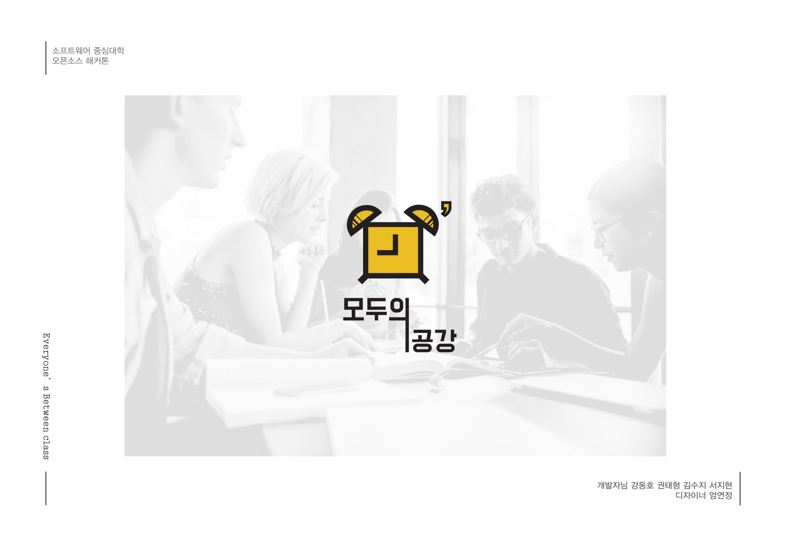
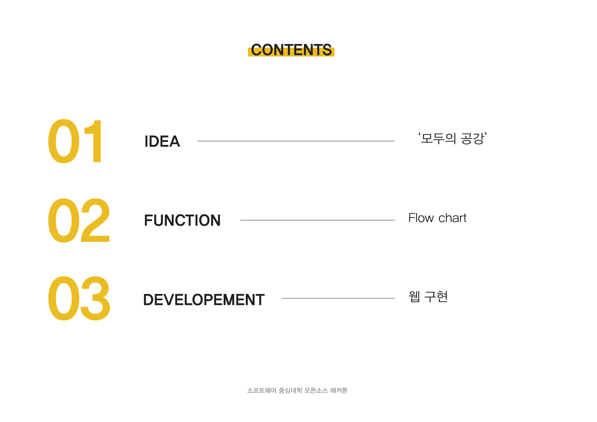
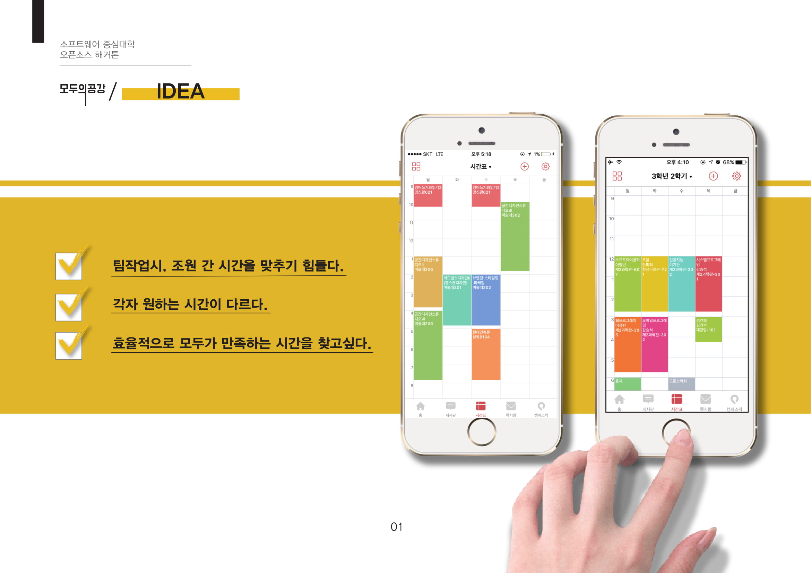
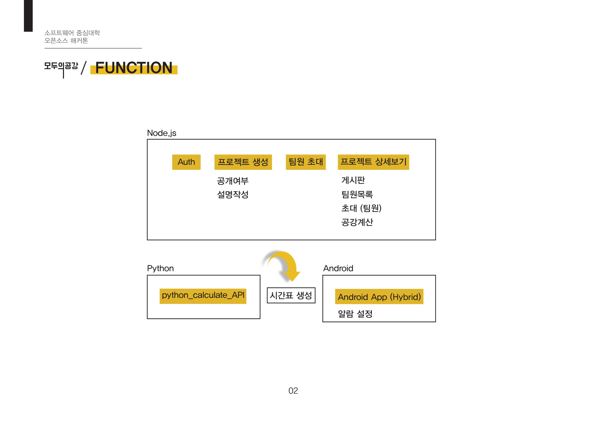
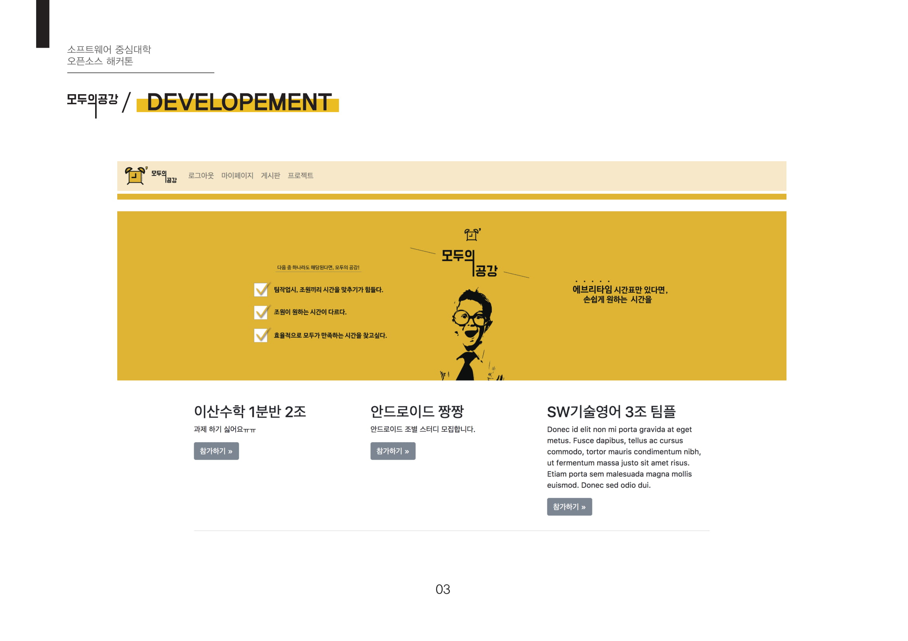
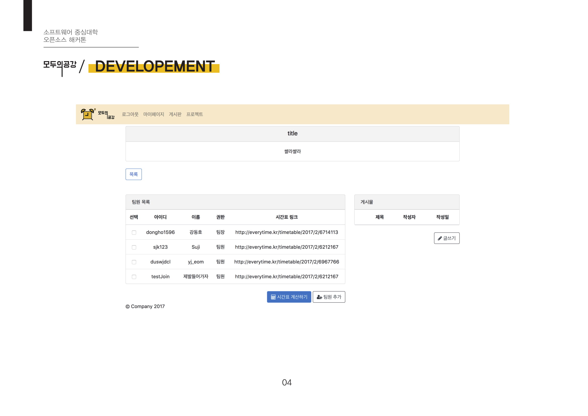

# 모두의 공강 공강 계산 API - 소프트웨어 중심대학 해커톤

* 팀원 간의 공강 계산을 해줍니다.
* using django selenium 

YouTube Demo 영상 : https://www.youtube.com/watch?v=yXwLjePAIlM

* 구현 결과는 영상을 통해서 확인하실 수 있고, 아래 이미지는 피피티 자료 이며, 구현 결과는 빠져있습니다.
* 저는 django와 selenium을 이용해서, 크롤링 된 데이터를 기반으로 팀원 간의 공강시간을 계산해주는 API 서버를 개발하였습니다.
* 주요 구현부분 :  script.py / views.py

